# Simple Java Client-Server

Das ist eine Änderung für Pull

1. Repository: https://github.com/jf-bht/versionskontrolle
2. Push eigenes Projekt:  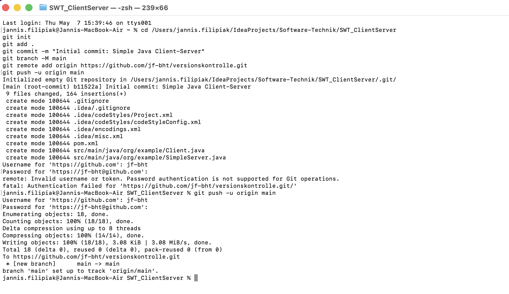
3. Git Methoden
	1. Status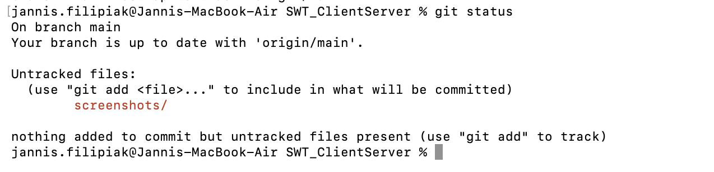
	2. Diff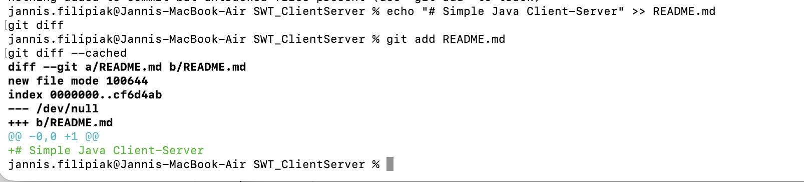
	3. Commit 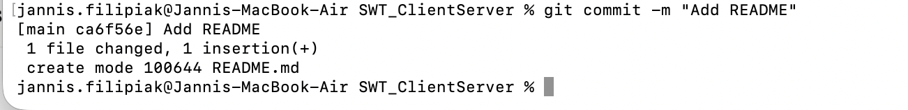
	4. Push + Log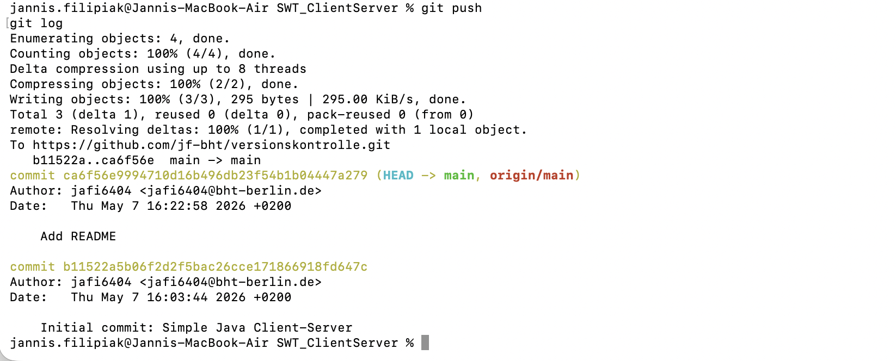
	5. MV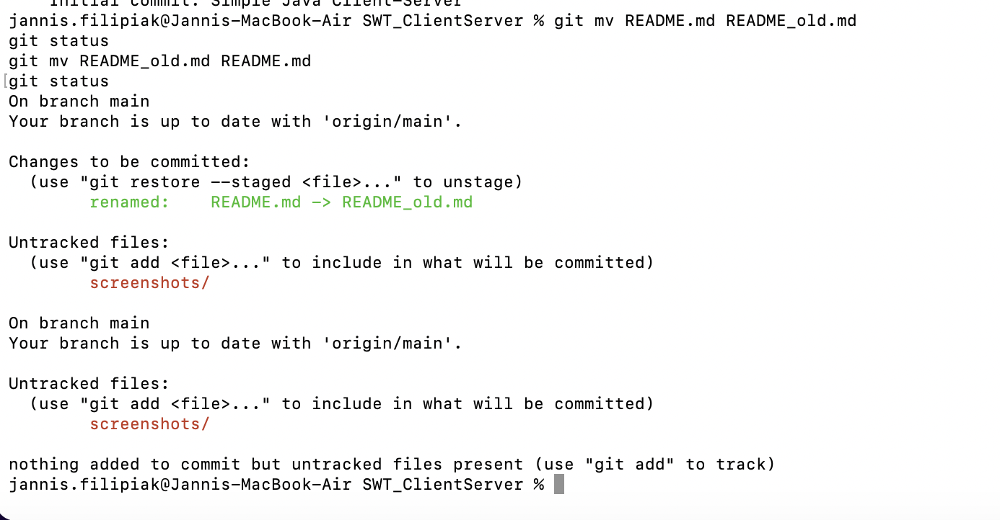
	6. RM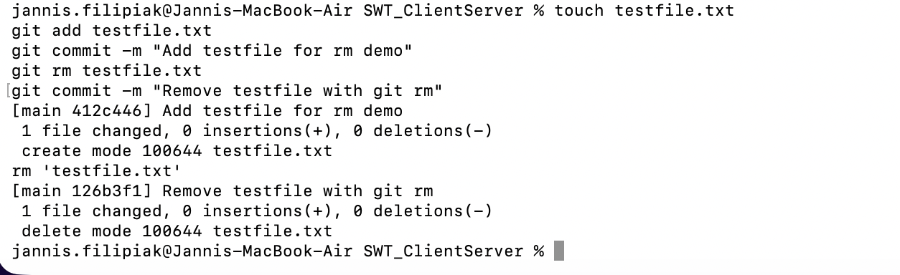
	7. Pull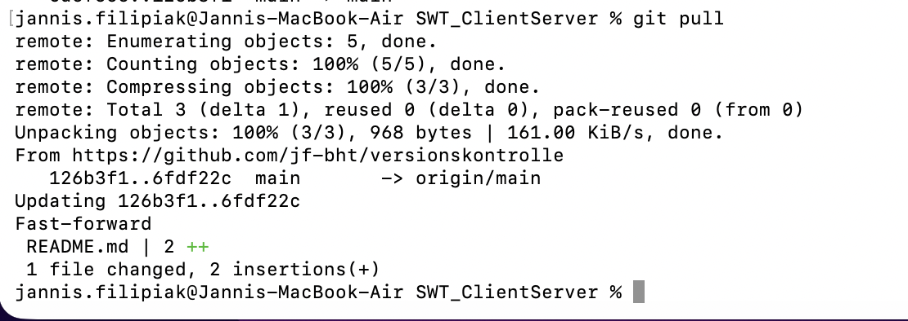
4. Zeitreise
	1. 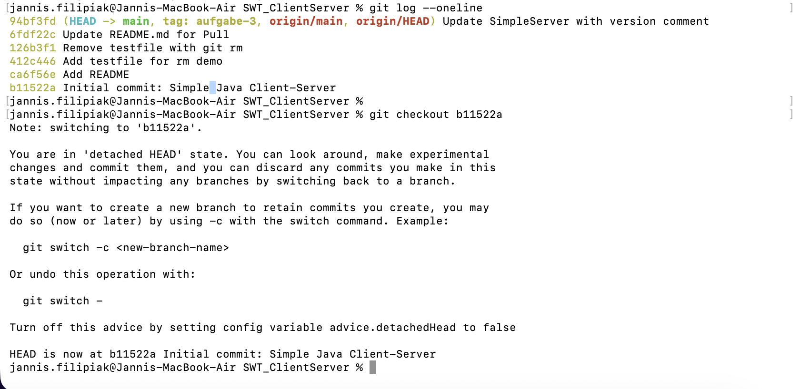
	2. 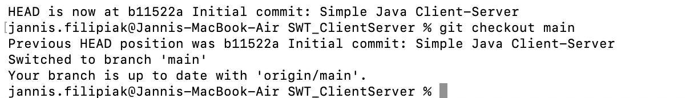
5. Branches
	1. Branch1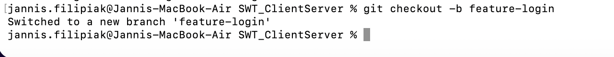
	2. Branch2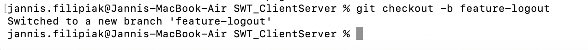
	3. Switch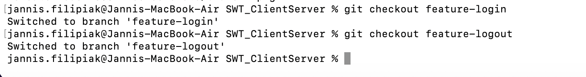
	4. Merge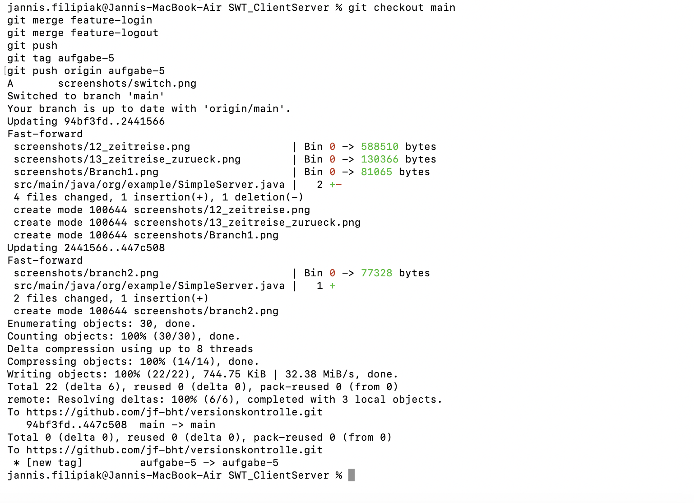
6. Pull Request: https://github.com/edlich/education/pull/596
